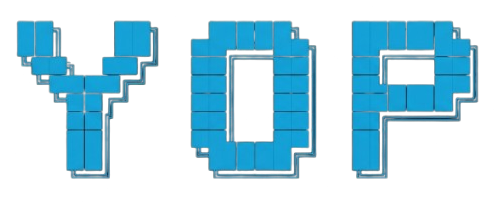

  <table>
    <tr>
      <td></td>
      <td>
         
         
         
        
      <td width="400">
        
         
        
        
        
        
        
        
        
        
        
  </table>

<!-- 

  

  
...

 -->
