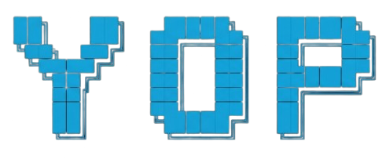

<!-- 

  
  

    
    
    
    
  

   
  

 -->
<!-- 

  
  
  
  
  
  
  
  
  

 -->
<!-- 

  

  
...

 -->

  &nbsp;&nbsp;
  
  

---

#### Featured Project
[Restaurant Website](https://github.com/ayoubelgourdi/restaurant-website) : A full restaurant website built with **Node.js, Express and EJS**, with a responsive layout styled using **Tailwind CSS** and data stored in **MySQL**.

  <i>Tech Stack</i>

  
  
  
  
  
  
  

---

  <i>Thanks for stopping by.</i>

